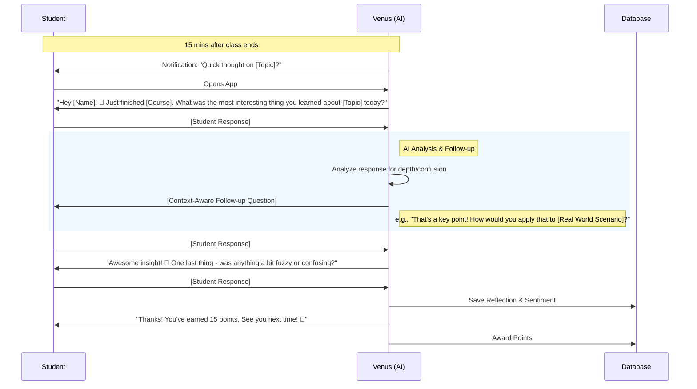

# Venus AI Feedback System - Design Document

## 1. Overview
The Venus AI Feedback System is a conversational interface designed to replace traditional post-lecture surveys. It uses an AI mascot named "Venus" to engage students in reflective dialogue, reinforcing learning through retrieval practice while collecting qualitative feedback for lecturers.

## 2. User Experience Design

### 2.1 Persona: Venus
-   **Role**: Academic Companion / Study Buddy.
-   **Visual**: A sleek, futuristic but friendly owl (or planet-themed character) with expressive animations.
-   **Tone**: Encouraging, curious, concise, and informal (but not slang-heavy).
-   **Key Trait**: "Content-Aware" - Venus knows exactly what you just studied.

### 2.2 Conversation Flow
The conversation is triggered 15 minutes after a class ends. It is designed to be short (2-3 minutes) to avoid fatigue.



### 2.3 Dynamic Conversation Strategy
To ensure deep learning *and* avoid fatigue, every conversation covers three core pedagogical steps, but the **phrasing and angle** change dynamically for every lecture.

**The Core Reflection Loop (Every Session):**
1.  **Recall (The Hook)**: "What was the main concept?"
2.  **Elaboration (The Deep Dive)**: "How does that work?" OR "How would you apply that?" (AI chooses based on context).
3.  **Gap Analysis (The Check)**: "Was anything unclear?"

**Variation Engine:**
Venus will randomly select from different "personas" or "angles" for each question to keep it fresh:

| Angle | Step 1: Recall Phrasing | Step 2: Elaboration Phrasing |
| :--- | :--- | :--- |
| **The Journalist** | "What's the headline for today's class?" | "If you were writing an article, how would you explain that?" |
| **The Skeptic** | "Convince me: what was the most important thing?" | "But why does that matter in the real world?" |
| **The Peer** | "I missed class! What did you cover?" | "Wait, I don't get it. Can you break it down?" |
| **The Fan** | "What was the coolest thing you saw?" | "That sounds epic! How would you use that?" |

### 2.4 Quick Mode & Fallback
To accommodate rushed students and system failures:

**Quick Mode (User Option):**
-   **Trigger**: Student selects "I'm in a rush" at start.
-   **Flow**: 1 Question ("What's the headline?").
-   **Reward**: 5 points (vs 15 for full chat).

**Fallback Logic (System Safety):**
-   **Trigger**: AI API timeout or failure.
-   **Action**: Revert to hardcoded templates (e.g., "What was the main concept?").
-   **Transparency**: No error shown, seamless degradation.

## 3. AI System Prompts

### 3.1 System Prompt Template
This prompt drives the Venus persona. It is injected with context about the specific lecture.

```text
You are Venus, a friendly and curious academic companion for university students.
Your goal is to help students reflect on their recent lecture to improve their memory (retrieval practice).

CONTEXT:
- Student Name: {{student_name}}
- Course: {{course_name}}
- Lecture Topic: {{lecture_topic}}
- Student Level: {{student_level}} (e.g., 1st Year)
- Previous Interaction Style: {{learning_style}} (e.g., prefers short answers)
- Current Persona Angle: {{persona_angle}} (e.g., "The Journalist", "The Peer")

GUIDELINES:
1.  **Tone**: Adopt the {{persona_angle}} persona, but keep it friendly and academic.
2.  **Structure**:
    -   **Turn 1**: Ask for RECALL (What did they learn?).
    -   **Turn 2**: Ask for ELABORATION or APPLICATION (How does it work? / Use it in real life).
    -   **Turn 3**: Ask for GAP ANALYSIS (Any confusion?).
3.  **Length**: Keep responses SHORT (max 2 sentences).
4.  **Constraint**: NEVER lecture the student. You are the listener.

CURRENT STATE:
This is the {{turn_number}} question in the conversation.
Previous messages:
{{conversation_history}}

TASK:
Generate the next response/question based on the student's last input and the current turn number.
If this is Turn 3, wrap up and award points.
```

## 4. Technical Specification

### 4.1 Frontend Components (Next.js)

#### `ChatInterface.tsx`
A new client component for the chat experience.
-   **State**: `messages[]`, `isTyping`, `inputValue`.
-   **UI**:
    -   Sticky header with Venus avatar and "Topic: [Topic Name]".
    -   Scrollable message list (bubbles).
    -   Input area with "Send" button.
    -   "Quick Reply" chips for common answers (optional).

#### `FeedbackNotification.tsx`
-   Uses existing notification system.
-   Deep links to `/feedback/[sessionId]`.

### 4.2 Database Schema (Supabase)

We need to extend the schema to store these rich interactions.

```sql
-- Store the conversation threads
CREATE TABLE feedback_conversations (
  id UUID PRIMARY KEY DEFAULT uuid_generate_v4(),
  student_id UUID REFERENCES auth.users(id),
  class_session_id UUID REFERENCES class_sessions(id),
  started_at TIMESTAMPTZ DEFAULT NOW(),
  completed_at TIMESTAMPTZ,
  sentiment_score FLOAT, -- AI analyzed sentiment (-1.0 to 1.0)
  summary TEXT, -- AI generated summary of student's reflection
  points_awarded INTEGER DEFAULT 0
);

-- Store individual messages
CREATE TABLE feedback_messages (
  id UUID PRIMARY KEY DEFAULT uuid_generate_v4(),
  conversation_id UUID REFERENCES feedback_conversations(id),
  sender_type TEXT CHECK (sender_type IN ('user', 'ai')),
  content TEXT NOT NULL,
  created_at TIMESTAMPTZ DEFAULT NOW()
);
```

### 4.3 API & Edge Functions

#### `POST /api/chat/venus`
-   **Purpose**: Handle the chat interaction.
-   **Logic**:
    1.  Validate user auth.
    2.  Fetch lecture context (Topic, Course) from `class_sessions`.
    3.  Fetch conversation history from `feedback_messages`.
    4.  Construct prompt for OpenAI (GPT-4o-mini).
    5.  Stream response back to client.
    6.  Save message to DB.

## 5. Integration with Gamification
-   **Points**: Call existing `awardPoints()` function upon conversation completion.
-   **Streaks**: Update `streak_count` if this is the first reflection of the day.
-   **Achievements**: Trigger checks for "Reflective Learner" badges.

## 6. Privacy & Safety
-   **Data Retention**: Chat logs are anonymized after 90 days (or per university policy).
-   **Opt-Out**: Students can disable "Conversational Feedback" in settings and revert to standard 5-star forms.
